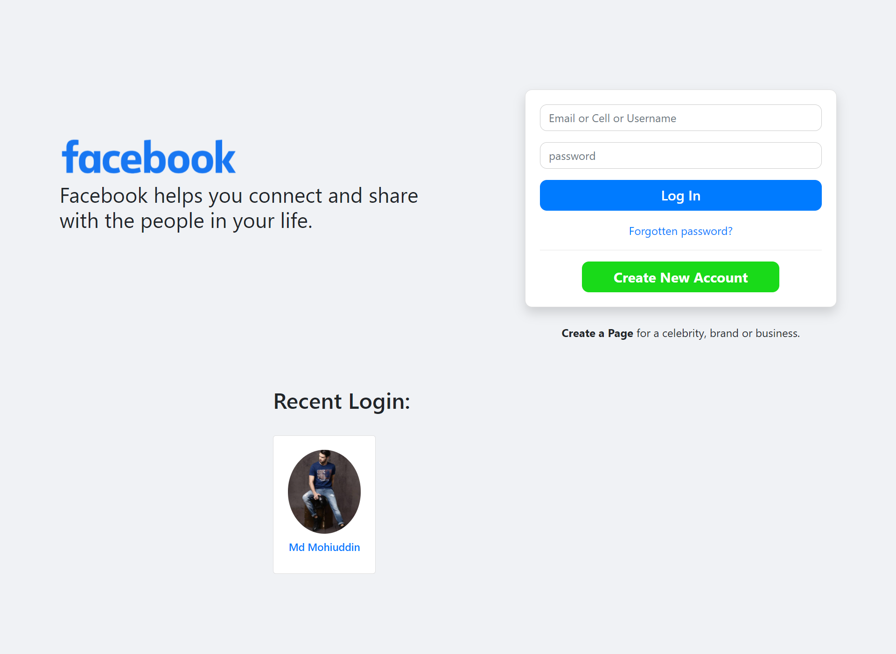
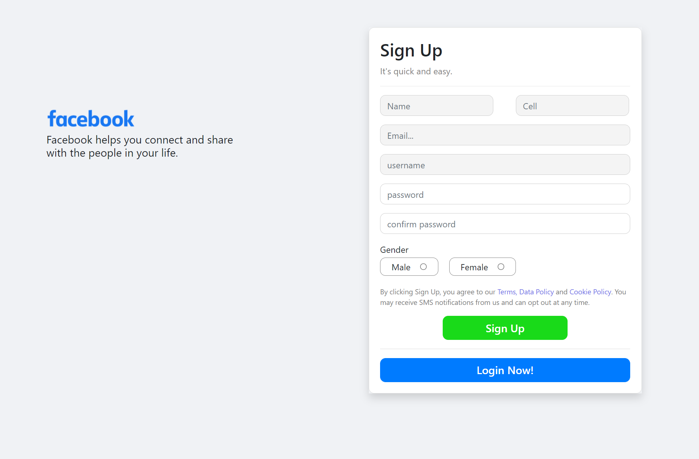
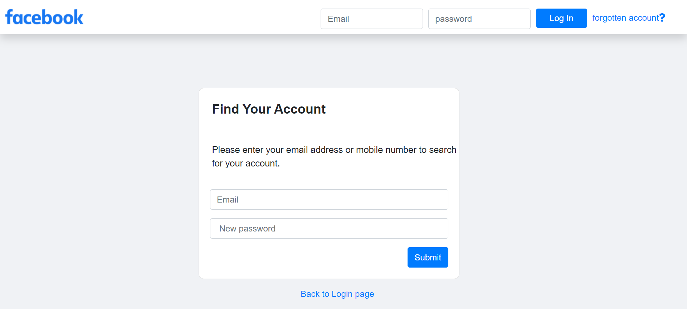
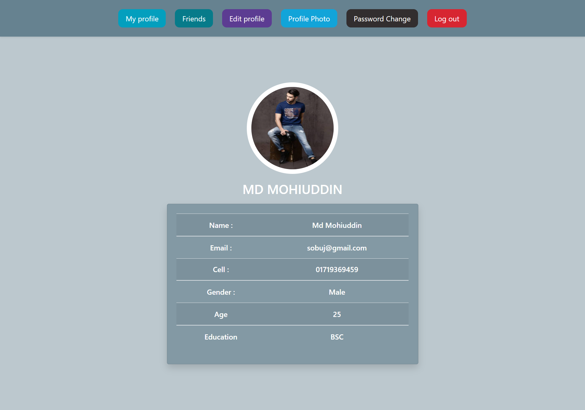

### Social_mini_project_using_rawphp_and_mysql
---
A simple Social mini project using raw php and mysql. Where you will get some functionality of social media like Facebook.

## Languge Used
---
This project is created by the following Languge:

 
 

### Features
---
- Registration 
- validation 
- Login 
- Forget password set
- cookie login 
- profile login 
- update profile 
- update profile photo 
- Change password 
- recent login features

### Sample Features Image
---
- Login Page view

- Registration Page view

- Forget Password setup page view

- Profile page view

